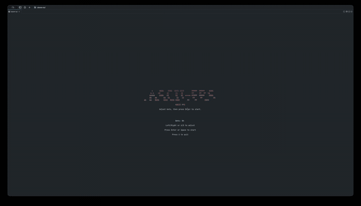

# ASCII-FPS

터미널에서 돌아가는 작은 1인칭 ASCII 슈터입니다. `DOOM`/`Wolfenstein` 계열의 진행감을 ASCII TUI로 옮긴 playable 데모이며, `terminal-kit`로 입력과 화면 제어를 다루고 게임 로직과 raycasting 렌더링은 직접 구현했습니다.



[Watch higher-quality WebM demo](./assets/optimized/demo.webm)

## 개요

- 시작 시 타이틀 화면에서 봇 수를 조절하고 직접 게임을 시작
- 플레이어와 몬스터 스폰이 매 라운드 랜덤
- 정확히 한 마리의 `5 HP` 보스가 등장
- 몬스터 체력에 따라 붉은 계열로 색상이 달라짐
- 피격 시 방향성 플래시와 흔들림 표시
- 클리어/사망 시 결과 시간과 엔딩 화면 표시

## 설치 및 실행

터미널에서 앱 이름만으로 실행:

```bash
ascii-fps
```

npm으로 전역 설치 후 실행:

```bash
npm i -g ascii-fps
ascii-fps
```

npx로 바로 실행:

```bash
npx ascii-fps
```

저장소 안에서 직접 실행:

```bash
./ascii-fps
```

`pnpm` 스크립트로 실행:

```bash
pnpm start
```

전역으로 링크해서 명령어로 쓰고 싶다면:

```bash
pnpm link --global
ascii-fps
```

몬스터 기본 수를 바꾸고 싶다면 환경변수로 조절할 수 있습니다.

```bash
DOOM_TUI_ENEMIES=14 ascii-fps
```

## 조작

- 타이틀 화면:
  - `Left` / `Right` 또는 `A` / `D`: 봇 수 조절
  - `Enter` / `Space`: 시작
  - `X`: 종료
- `W` / `S`: 전진 / 후진
- `↑` / `↓`: 전진 / 후진
- `A` / `D`: 좌우 이동
- `Q` / `E` 또는 `←` / `→`: 회전
- `Space` / `Enter`: 발사
- `R`: 사망 또는 승리 후 재시작
- `X`: 종료

## 주의사항

- 게임 플레이 중 한글 입력이 감지되면 일시정지되고, 영문 입력으로 바꾸라는 안내가 중앙에 뜹니다.
- README에는 작은 GIF를 사용하고, 고화질 데모는 WebM으로 별도 제공합니다.

## 특징

- ASCII raycasting 1인칭 시점
- ANSI 256-color 팔레트 기반 터미널 렌더링
- `terminal-kit` 기반 입력/화면 제어
- 적 추적 AI와 근접 공격
- 랜덤 스폰과 조절 가능한 몬스터 수
- 미니맵, HUD, 무기 애니메이션
- 시간 기록과 엔딩 화면

## 자동 배포

GitHub Actions와 npm Trusted Publisher를 연결해 두면, 새 버전을 만들고 GitHub Release를 발행하는 순간 npm에 자동으로 배포할 수 있습니다.

## 구조

- `src/main.js`: 터미널 초기화, 루프, 종료 처리
- `src/input.js`: `terminal-kit` 키 이벤트를 게임 입력 상태로 변환
- `src/game.js`: 이동, 충돌, 사격, 적 AI
- `src/render.js`: ANSI 버퍼 렌더링

## 개발

```bash
pnpm install
pnpm test
```
